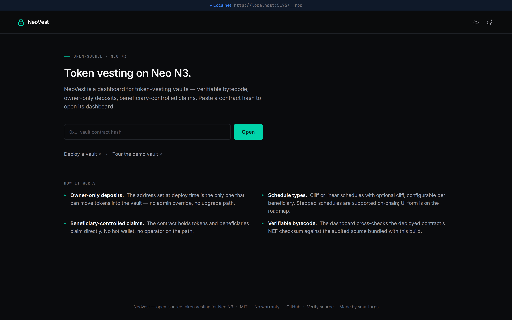
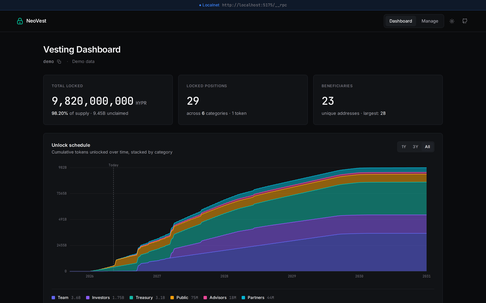
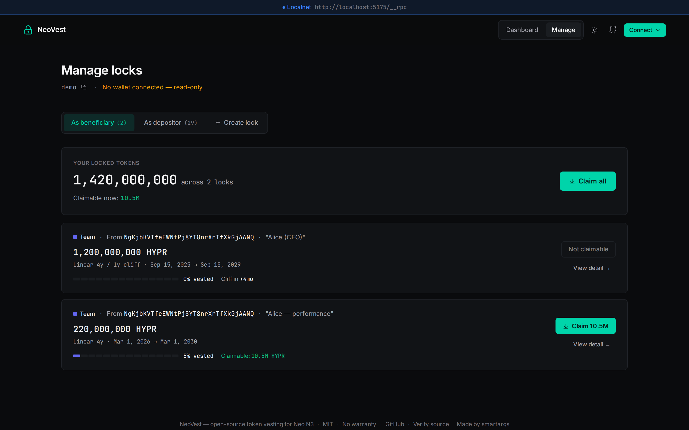
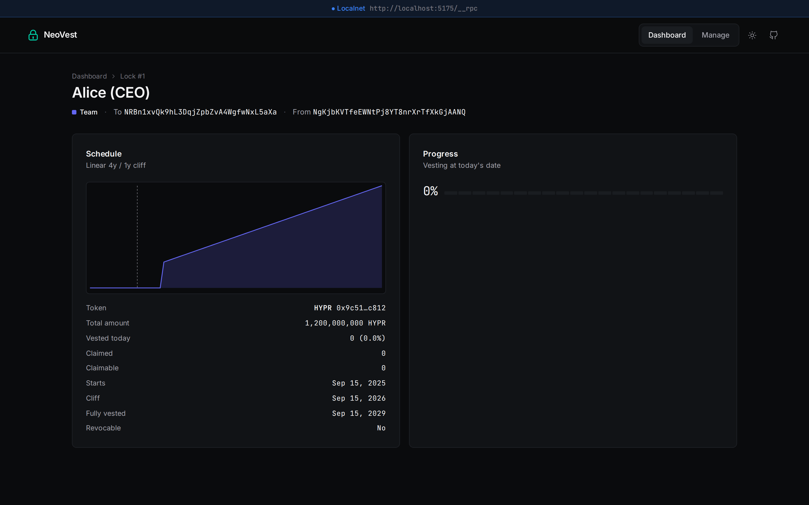
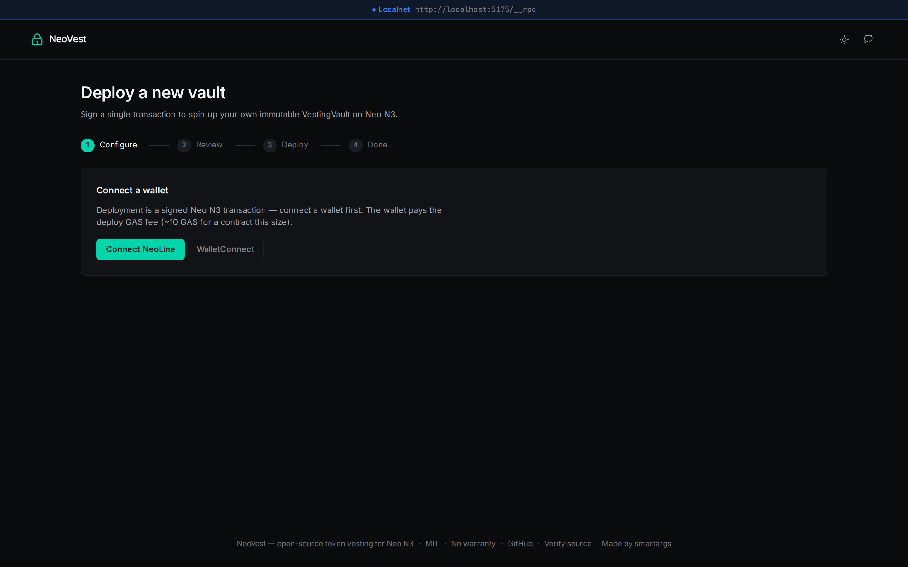

# NeoVest

Trustless token vesting for Neo N3. An immutable smart contract anyone can
deploy in a single transaction, plus a static dashboard SPA that runs against
any deployment.

> **Status:** alpha. The contract has internal tests but has **not** been
> audited by an external party. Do not deposit production funds without
> reviewing [`docs/SECURITY.md`](docs/SECURITY.md) first.

## Why

Neo N3 doesn't have a standard, public vesting primitive. Projects launching
tokens typically publish a vesting schedule in their tokenomics — *"team
tokens unlock linearly over four years with a one-year cliff"* — and then
hold those tokens in a wallet the team controls. The schedule is a promise.
There's nothing on-chain that prevents the team from spending the supply
the day after launch, and nothing investors or the community can verify
without trusting the team's word.

NeoVest is the missing primitive: a small, immutable smart contract that
takes custody of the tokens and releases them on the published schedule —
and a public dashboard that lets anyone audit it.

- **The promise becomes a proof.** Once tokens are deposited into the
  vault, the on-chain schedule is the schedule. The owner cannot withdraw
  early, change the unlock dates, redirect to a different beneficiary, or
  upgrade the contract. The only escape hatch — `revoke` — exists only on
  locks the owner explicitly marked revocable at creation, and even then
  the unvested portion returns to the owner; nothing ever bypasses the
  vested cliff for the beneficiary.
- **Public by default.** Every lock, schedule, beneficiary, and claim is
  readable by anyone with an RPC URL. Investors, exchange listing teams,
  and community members can confirm at any time that the team's
  tokenomics page matches what's actually locked on-chain.
- **No operator on the path.** The contract holds the tokens directly.
  Beneficiaries claim straight from the vault — no multi-sig hot wallet,
  no custodian, no operator who could censor or delay claims.
- **Self-deployable from the browser.** Connect a wallet, click Deploy,
  sign one transaction. The full source is reproducibly compilable so
  anyone who cares can verify the deployed bytecode against the audited
  source.
- **Static dashboard, no backend.** The UI runs in any browser against
  Neo's public RPC. Nothing to keep alive; nothing to take offline.

## How it works

```
                                                ┌──────────────────┐
                                                │  Dashboard SPA   │
                                                │ (read-only view) │
                                                └────────┬─────────┘
                                                         │ Neo RPC
┌──────────────┐    NEP-17 transfer + data    ┌──────────▼─────────┐
│  Owner       │ ────────────────────────────▶│   VestingVault     │
│  (wallet)    │                              │   (immutable)      │
└──────────────┘                              └──────────┬─────────┘
                                                         │  claim()
                                              ┌──────────▼─────────┐
                                              │   Beneficiary      │
                                              │   (wallet)         │
                                              └────────────────────┘
```

1. **Deploy** — anyone connects a wallet on the Deploy page and signs one
   transaction. The owner address (set at deploy time) is the only address
   allowed to deposit afterwards. The contract hash is deterministic and
   shown to you before you sign.
2. **Create a lock** — the owner calls `transfer(vault, amount, data)` on
   any NEP-17 token. The `data` payload encodes the lock parameters
   (beneficiary, schedule type, dates, category, note, revocable flag). The
   vault's `onPayment` callback validates the parameters and creates the
   lock atomically. One transaction. No separate approval step.
3. **Vest over time** — three schedule types:
   - **Cliff** — all tokens unlock on a single date.
   - **Linear** — continuous vesting between two dates, with optional cliff.
   - **Stepped** — equal tranches at fixed intervals. *(Contract supported;
     UI form coming — see [`ROADMAP.md`](ROADMAP.md).)*
4. **Claim** — the beneficiary calls `claim(lockId)`. The contract computes
   `vested - alreadyClaimed`, transfers that amount, and updates state.
   Anyone can call `vestedAmount` / `claimableAmount` to read the current
   state without sending a transaction.
5. **Revoke (optional)** — for locks created with `revocable: true`, the
   owner can call `revoke(lockId)` to return the unvested portion. The
   beneficiary keeps the right to claim what already vested.

The full math reference lives in [`docs/SCHEDULE.md`](docs/SCHEDULE.md);
the security model in [`docs/SECURITY.md`](docs/SECURITY.md).

## Try it

Spin up the UI locally and open the demo vault — Hyperion (HYPR) with 26
locks across 6 categories — to see the dashboard with realistic data:

```
cd ui && npm install && npm run dev
# then open http://localhost:5173/v/demo
```

For end-to-end testing on a real chain (deploy + create locks + claim) see
[`docs/LOCAL.md`](docs/LOCAL.md), which walks through spinning up a private
Neo3 net via Docker and connecting NeoLine.

## Screenshots

**Landing.** Hero, vault history with role badges, and at-a-glance feature summary.



**Dashboard.** Public read-only view of every lock in a vault, its schedule, and how much has vested.



**Manage.** Beneficiaries claim, owners revoke and create locks. Wallet-gated.



**Lock detail.** Per-lock schedule curve, vesting progress, and claim history.



**Deploy.** Sign one transaction. Cost is estimated via RPC; the future contract hash is computed deterministically before signing.



## Layout

```
contract/   neow3j Java smart contract (VestingVault)
deploy/     CLI deployment scripts (alternative to in-browser deploy)
ui/         Vite + React + TypeScript dashboard
docs/       LOCAL · DEPLOY · VERIFY · SCHEDULE · SECURITY · UI
localnet/   helper scripts for AxLabs/neo3-privatenet-docker
```

## Quickstart

### Run the dashboard

```
cd ui
cp .env.example .env.local      # set VITE_NETWORK, optionally VITE_WC_PROJECT_ID
npm install
npm run dev
```

Open <http://localhost:5173>. Paste a vault contract hash, or click
**Deploy** to spin up a fresh one with your connected wallet, or open
`/v/demo` for the canned demo dataset.

### Compile + test the contract

```
./gradlew :contract:test
./gradlew :contract:neow3jCompile
```

### Deploy a vault

The simplest path is **from the browser**: open the UI, click **Deploy**,
sign one transaction in your wallet. The dashboard estimates cost via RPC
and computes the future contract hash deterministically before you sign.

A CLI fallback is available for scripted/CI deployments — see
[`docs/DEPLOY.md`](docs/DEPLOY.md).

### Local-net testing

```
./localnet/start.sh             # cd ui && npm run dev   (in another shell)
```

Full walkthrough: [`docs/LOCAL.md`](docs/LOCAL.md).

## Documentation

- [`docs/LOCAL.md`](docs/LOCAL.md) — end-to-end local testing on a private Neo3 net
- [`docs/DEPLOY.md`](docs/DEPLOY.md) — compile, test, deploy (in-browser + CLI)
- [`docs/VERIFY.md`](docs/VERIFY.md) — confirm a deployed contract matches this source
- [`docs/SCHEDULE.md`](docs/SCHEDULE.md) — vesting math reference
- [`docs/SECURITY.md`](docs/SECURITY.md) — known limitations, audit status
- [`docs/UI.md`](docs/UI.md) — host and customize the dashboard
- [`ROADMAP.md`](ROADMAP.md) — open design questions and known follow-ups

## Contributing

Pull requests welcome. See [`CONTRIBUTING.md`](CONTRIBUTING.md) for the
short version: fork, branch, run the tests, open a PR. Please keep changes
focused — small, reviewable commits beat sprawling rewrites, especially for
contract code where every byte matters for reproducible bytecode.

If you find a security issue, **please don't** open a public issue.
Instructions for responsible disclosure are in [`docs/SECURITY.md`](docs/SECURITY.md).

## Built with

- **[neow3j](https://github.com/neow3j/neow3j)** — Java devpack for the smart contract
- **[Neo N3](https://neo.org/)** — the host blockchain
- **[Vite](https://vitejs.dev/)** + **[React](https://react.dev/)** + **TypeScript** — dashboard
- **[neon-js](https://github.com/CityOfZion/neon-js)** + **[neon-dappkit](https://github.com/CityOfZion/neon-dappkit)** — RPC + wallet integration
- **[Reown AppKit](https://reown.com/)** + **[appkit-neo3-adapter](https://github.com/CityOfZion/appkit-adapters)** — WalletConnect bridge
- **[NeoLine](https://neoline.io/)** — primary supported wallet
- **[AxLabs/neo3-privatenet-docker](https://github.com/AxLabs/neo3-privatenet-docker)** — local-net for development

## Disclaimer

Provided as-is, without warranty of any kind. The authors do not operate
any deployed instance. **Audit the contract before depositing real value** —
locked tokens cannot be recovered if a contract is deployed incorrectly or
contains an undisclosed bug.

## License

[MIT](LICENSE). Copyright © 2026 NeoVest contributors.
